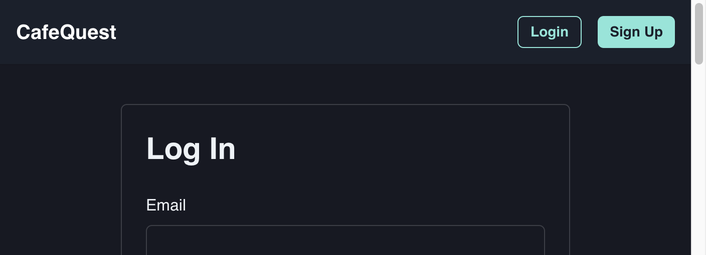
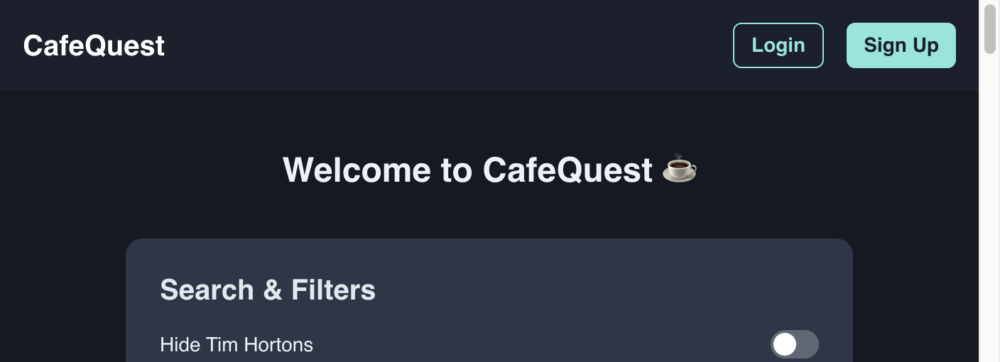

<div align="center">

# ☕ CafeQuest

### Discover local cafes and save your favorites

[](https://cafequest.vercel.app)
[](https://nextjs.org/)
[](https://reactjs.org/)
[](https://firebase.google.com/)

[Live Demo](https://cafequest.vercel.app) · [Report Bug](https://github.com/imRanDan/cafequest/issues) · [Request Feature](https://github.com/imRanDan/cafequest/issues)

</div>

---

## 📖 About The Project

**CafeQuest** is a location-based cafe discovery web application that helps coffee lovers find nearby cafes using real-time data from OpenStreetMap. Built with Next.js 15 and Firebase, it features an interactive Mapbox map, smart filtering options, and the ability to save favorite cafes to a personal dashboard.

### ✨ Key Highlights

- 🗺️ **Interactive Mapbox Map** with custom cafe markers and real-time user location
- 🔍 **Google Places Autocomplete** for intelligent location search
- 🎯 **Smart Filtering** - Hide chains (Tim Hortons, Starbucks) and find late-night cafes (open ≥ 9pm)
- 💾 **Personal Dashboard** with Firebase Firestore to save and manage favorite cafes
- 🔐 **Secure Authentication** with Firebase Auth and protected routes
- 📱 **Responsive Design** with mobile-optimized navigation
- ⚡ **Performance Optimized** with API request caching and rate limiting

---

## 🖼️ Screenshots

<div align="center">

### Homepage & Map Interface


### User Authentication


### Interactive Map with Filters


</div>

---

## 🚀 Features

### Core Functionality
- **📍 Location Search** – Google Places autocomplete with fallback to Nominatim API
- **🗺️ Mapbox Integration** – Interactive map powered by Mapbox GL JS and react-map-gl
- **📌 GPS Location** – Automatic user location detection with geolocation API
- **☕ Real-time Cafe Data** – Fetches cafes from OpenStreetMap via Overpass API (5km radius)
- **🔍 Smart Filters:**
  - Hide Tim Hortons
  - Hide Starbucks
  - Show only late-night cafes (open ≥ 9pm)
- **💾 Save Cafes** – Bookmark cafes with name, address, and opening hours
- **🗑️ Manage Favorites** – Delete cafes from your saved list
- **📊 Cafe Details** – View address, opening hours, and link to Google Maps

### Technical Features
- **🔒 Protected Routes** – Dashboard and profile require authentication
- **🎨 Chakra UI** – Modern component library with dark mode support
- **⚡ API Optimization:**
  - Request caching (30-minute expiration)
  - Rate limiting (1 request/second)
  - Debounced search input (400ms)
- **🔔 Toast Notifications** – User feedback for all actions
- **📱 Responsive UI** – Mobile menu with Avatar dropdown
- **🎭 Loading States** – Spinners for async operations
- **🔥 Firebase Integration:**
  - Email/password authentication
  - Firestore for user data and saved cafes
  - Security rules for data protection
- **📈 Vercel Analytics** – Built-in analytics tracking

---

## 🛠️ Tech Stack

### Frontend
- **[Next.js 15](https://nextjs.org/)** – React framework with App Router
- **[React 18](https://reactjs.org/)** – UI library
- **[Chakra UI](https://chakra-ui.com/)** – Component library with built-in dark mode
- **[Mapbox GL JS](https://www.mapbox.com/)** + **[react-map-gl](https://visgl.github.io/react-map-gl/)** – Interactive maps
- **[react-icons](https://react-icons.github.io/react-icons/)** – Icon library (FaHeart for save button)
- **Custom Fonts** – Geist Sans & Geist Mono (local fonts)

### Backend / Services
- **[Firebase Auth](https://firebase.google.com/products/auth)** – User authentication (email/password)
- **[Firestore](https://firebase.google.com/products/firestore)** – NoSQL database for user profiles and saved cafes
- **[Google Places API](https://developers.google.com/maps/documentation/places/web-service)** – Location autocomplete
- **[Nominatim API](https://nominatim.org/)** – Fallback geocoding service
- **[Overpass API](https://overpass-api.de/)** – Query OpenStreetMap for cafe data
- **[Mapbox API](https://www.mapbox.com/)** – Map tiles and rendering
- **[Vercel Analytics](https://vercel.com/analytics)** – Usage tracking

### Libraries & Tools
- **[axios](https://axios-http.com/)** – HTTP client for API requests
- **[lodash.debounce](https://lodash.com/docs/#debounce)** – Debounce search input
- **[use-places-autocomplete](https://github.com/wellyshen/use-places-autocomplete)** – Google Places autocomplete hook

### Development Tools
- **[Jest](https://jestjs.io/)** – Testing framework
- **[@testing-library/react](https://testing-library.com/react)** – Component testing
- **[Babel](https://babeljs.io/)** – JavaScript compiler for tests
- **ESLint** – Code linting

---

## 📦 Getting Started

### Prerequisites

- **Node.js 18+** ([Download](https://nodejs.org/))
- **Firebase Project** with Firestore and Authentication enabled ([Setup Guide](https://firebase.google.com/docs/web/setup))
- **Google Maps API Key** with Places API enabled ([Get API Key](https://developers.google.com/maps/documentation/javascript/get-api-key))
- **Mapbox Access Token** ([Sign up](https://www.mapbox.com/))

### Installation

1. **Clone the repository**
```bash
git clone https://github.com/imRanDan/cafequest.git
cd cafequest
```

2. **Install dependencies**
```bash
npm install
```

3. **Configure environment variables**

Create a `.env.local` file in the root directory:

```env
# Firebase Configuration
NEXT_PUBLIC_FIREBASE_API_KEY=your_firebase_api_key
NEXT_PUBLIC_FIREBASE_AUTH_DOMAIN=your_project.firebaseapp.com
NEXT_PUBLIC_FIREBASE_PROJECT_ID=your_project_id
NEXT_PUBLIC_FIREBASE_STORAGE_BUCKET=your_project.appspot.com
NEXT_PUBLIC_FIREBASE_MESSAGING_SENDER_ID=your_sender_id
NEXT_PUBLIC_FIREBASE_APP_ID=your_app_id
NEXT_PUBLIC_FIREBASE_MEASUREMENT_ID=your_measurement_id

# Google Maps API Key
NEXT_PUBLIC_GOOGLE_API_KEY=your_google_maps_api_key

# Mapbox Access Token
NEXT_PUBLIC_MAPBOX_ACCESS_TOKEN=your_mapbox_token
```

4. **Set up Firebase Firestore Security Rules**

In your Firebase Console, navigate to Firestore Database > Rules and add:

```javascript
rules_version = '2';
service cloud.firestore {
  match /databases/{database}/documents {
    // User documents
    match /users/{userId} {
      allow read, write: if request.auth != null && request.auth.uid == userId;
      
      // Saved cafes subcollection
      match /savedCafes/{cafeId} {
        allow read, write: if request.auth != null && request.auth.uid == userId;
      }
    }
  }
}
```

5. **Enable Authentication in Firebase**
   - Go to Firebase Console > Authentication
   - Enable "Email/Password" sign-in method

6. **Run the development server**
```bash
npm run dev
```

Open [http://localhost:3000](http://localhost:3000) in your browser.

---

## 🧪 Testing

Run the test suite:

```bash
npm test
```

Current test coverage includes:
- `Map.test.jsx` – Map component rendering and interactions
- `SearchBar.test.jsx` – Search functionality

---

## 🏗️ Project Structure

```
cafequest/
├── src/
│   ├── app/                          # Next.js App Router pages
│   │   ├── dashboard/                # User dashboard (protected)
│   │   │   └── page.jsx              # Displays saved cafes as cards
│   │   ├── profile/                  # User profile (protected)
│   │   │   └── page.jsx              # User info and logout
│   │   ├── login/                    # Login page
│   │   │   └── page.jsx              # Email/password login
│   │   ├── signup/                   # Sign up page
│   │   │   └── page.jsx              # User registration with Firestore
│   │   ├── layout.js                 # Root layout with Navbar, Footer, Providers
│   │   ├── page.js                   # Homepage with map and filters
│   │   └── globals.css               # Global styles
│   ├── components/                   # React components
│   │   ├── Map.jsx                   # Mapbox map with markers & popups
│   │   ├── CafeCard.jsx              # Cafe card for dashboard
│   │   ├── LocationSearchInput.jsx   # Google Places autocomplete
│   │   ├── Navbar.jsx                # Navigation with auth state
│   │   ├── Footer.jsx                # Footer component
│   │   ├── LoadingSpinner.jsx        # Loading indicator
│   │   └── ...                       # Other UI components
│   ├── config/                       # Configuration files
│   │   └── firebase.js               # Firebase initialization
│   ├── utils/                        # Utility functions
│   │   ├── AuthProvider.js           # Auth context provider
│   │   └── ThemeProvider.js          # Theme context provider
│   ├── providers/                    # Context providers
│   │   └── Providers.jsx             # Combines all providers
│   └── styles/                       # Additional styles
├── images/                           # Screenshots
├── jest.config.js                    # Jest configuration
├── jest.setup.js                     # Jest setup file
├── package.json                      # Dependencies
└── README.md
```

---

## 🎯 How It Works

### Location Search Flow
1. User types in the search box (powered by Google Places autocomplete)
2. User selects a location or clicks "Search"
3. Location is geocoded to latitude/longitude
4. Overpass API fetches cafes within 5km radius
5. Results are cached for 30 minutes
6. Markers appear on the Mapbox map

### Filtering System
- **Hide Tim Hortons/Starbucks:** Filters by cafe name
- **Open Late:** Parses `opening_hours` tag from OSM data, excludes cafes closing before 9pm

### Save Cafe Flow
1. User clicks marker on map → popup appears
2. User clicks "Save" button
3. Checks if user is logged in (Firebase Auth)
4. Saves to Firestore: `users/{userId}/savedCafes/{cafeId}`
5. Toast notification confirms save
6. Cafe appears on dashboard

---

## 📝 Usage

### For Users

1. **Browse Cafes**
   - Visit homepage
   - Allow location access or search for a city/postal code
   - Click "Show cafes near me" or use the search bar

2. **Filter Results**
   - Toggle switches to hide Tim Hortons or Starbucks
   - Enable "Open late" to find cafes open past 9pm

3. **Create Account**
   - Click "Sign Up"
   - Enter full name, email, and password
   - Account is created in Firebase

4. **Save Cafes**
   - Click any cafe marker on the map
   - View details in the popup
   - Click "Save" (requires login)
   - Access saved cafes from Dashboard

5. **Manage Favorites**
   - Navigate to Dashboard
   - View all saved cafes as cards
   - Click "Delete" to remove

---

## 🚧 Roadmap

- [x] Mapbox integration with custom markers
- [x] Google Places autocomplete search
- [x] GPS location detection
- [x] Smart filters (chains, late-night)
- [x] User authentication with Firebase
- [x] Save cafes to Firestore
- [x] User dashboard with cafe cards
- [x] Delete saved cafes
- [x] Responsive mobile design
- [x] API caching and rate limiting
- [ ] Search/filter within saved cafes
- [ ] Cafe photos from Google Places API
- [ ] User reviews and ratings
- [ ] Share cafes with friends
- [ ] PWA support for offline access
- [ ] Email verification
- [ ] Password reset functionality

---

## 🤝 Contributing

Contributions are welcome! Please follow these steps:

1. Fork the project
2. Create your feature branch (`git checkout -b feature/AmazingFeature`)
3. Commit your changes (`git commit -m 'Add some AmazingFeature'`)
4. Push to the branch (`git push origin feature/AmazingFeature`)
5. Open a Pull Request

---

## 📝 License

Distributed under the MIT License. See `LICENSE` for more information.

---

## 👤 Author

**Danyal Imran**

- Portfolio: [danyalimran.com](https://danyalimran.com)
- GitHub: [@imRanDan](https://github.com/imRanDan)
- LinkedIn: [Danyal Imran](https://linkedin.com/in/danyal-imran)

---

## 🙏 Acknowledgments

- [Next.js](https://nextjs.org/) – React framework
- [Chakra UI](https://chakra-ui.com/) – Component library
- [Mapbox](https://www.mapbox.com/) – Map tiles and API
- [OpenStreetMap](https://www.openstreetmap.org/) – Cafe data source
- [Firebase](https://firebase.google.com/) – Authentication and database
- [Google Maps Platform](https://developers.google.com/maps) – Places API
- [Vercel](https://vercel.com/) – Deployment and hosting

---

## 🔧 API Rate Limits & Best Practices

This project implements several optimizations:

- **Caching:** API responses cached for 30 minutes
- **Rate Limiting:** Max 1 request per second to Overpass API
- **Debouncing:** Search input debounced to 400ms
- **Request Limiting:** Display limit of 10 markers initially, loads more on map movement

---

<div align="center">

Made with ☕ by [Danyal Imran](https://danyalimran.com)

⭐ Star this repo if you found it helpful!

</div>
